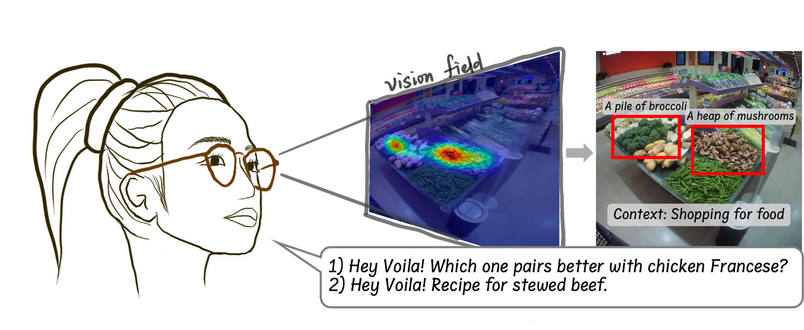

# G-VOILA: A Gaze-Facilitated Question Answering Assistant on Smart Glasses

   
    

## Overview 
With the advancement of wearable device and AI, querying with intelligent assistant anywhere and anytime is becoming a reality. We implement G-VOILA, a gaze-facilitated question answering assistant on smart glasses. With our code, G-VOILA can be reproduced with public available devices and resources.

