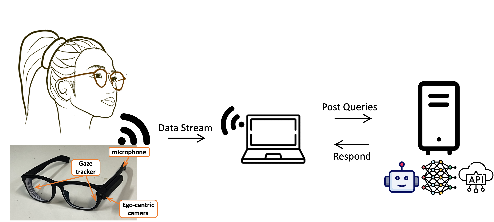

# G-VOILA : Gaze-Facilitated Information Querying in Daily Scenarios

<p align="center">
   
    
</p>

## Bulletin board
- [TODO] We are preparing the code for reimplementation, refer to folder [experiment_pipeline](./experiment_pipeline) for the latest updates.
- [2024-06-15] Our paper "G-VOILA: Gaze-Facilitated Information Querying in Daily Scenarios" has been accepted by IMWUT 2024.
- [2024-01-08] We released the code for G-VOILA, a real-time gaze-facilitated question answering assistant on smart glasses.

## Overview 
With the advancement of wearable device and AI, querying with intelligent assistant anywhere and anytime is becoming a reality. We implement G-VOILA, a gaze-facilitated question answering assistant on smart glasses. With our code, G-VOILA can be reproduced with public available devices and resources.



G-VOILA requires a PC to receive the data stream in realtime from smart glasses and process it. The preprocessed data were sent to a GPU server which runs a service to answer user's questions. The answer will be sent back to the PC and displayed to the user. 

## Real-time pipeline


### Components 1 - Agent Service (PC / GPU Server)
Code to setup the agent service on PC / GPU server is in [voila-service](./voila-service) folder. For requirements and setup, please refer to [voila-service/README.md](./voila-service/README.md).

[GPT-4v](https://platform.openai.com/docs/guides/vision) serves as the main visual language model to answer user's questions, one need to paste their own API key to use it. [Whisper](https://github.com/openai/whisper) is used to transcript the user's audio query to text. [SAM](https://github.com/facebookresearch/segment-anything) is used to crop the object of interest based on gaze points from the user's view. Both Whisper and SAM requires a GPU to run, yet one can substitute them with official API if GPU is not available.

### Components 2 - Smart Glasses (Pupil Lab Invisible)
For smart glasses, we use [Pupil Lab Invisible(setup tutorials)](https://docs.pupil-labs.com/invisible/) as the hardware. When running G-VOILA, Pupil Lab Invisible and the hosting PC should connect to the same network. 
```
python main.py
```


### Components 3 - Query Trigger (Wireless Push Button)
To start querying, a trigger is needed. While keyword spotting such as "Hey VOILA" is a promising solution, we use a wireless push button as a simple yet effective solution. The button is connected to the PC via Wi-Fi, that is, the button, Pupil Lab Invisible and the PC should connect to the same network.

The code for making your own Wi-Fi button is in [WiFiButton](./WiFiButton) folder. We used ESP32 dev board. For requirements and setup, please refer to [WiFiButton/README.md](./WiFiButton/README.md).

To switch another triggering method, one can implement a customized [ControlSignal](ControlSignal.py) class.